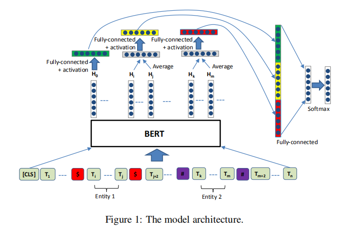

* 记录在知识图谱实践中所应用的一些算法
* 记录构建知识图谱的一些思路

# 环境

ubuntu16.04

python3.6
* tensorflow
* scikit-learn 


# 关系抽取

## 数据

以[2019语言与智能技术竞赛](http://lic2019.ccf.org.cn/kg) 的数据作为训练、测试用数据 。

## 模型1

[Enriching Pre-trained Language Model with Entity Information for Relation Classification](https://www.researchgate.net/publication/333353661_Enriching_Pre-trained_Language_Model_with_Entity_Information_for_Relation_Classification)

模型结构，来源于论文：



使用模型

```shell
cd ./relation_extract
python run_classifier_01.py
```